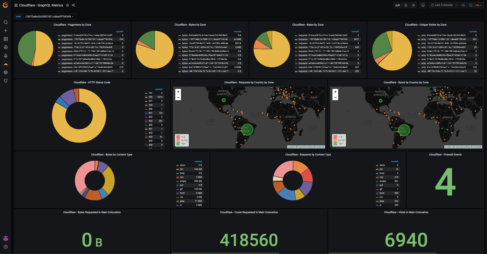

# WARNING

> :warning:
> This exporter is in early development and yet have some performance issues, but it works.
> Even though, if you still wanna use it, keep it in mind.

# cloudflare-gql-exporter

This is an exporter that exposes information gathered from Cloudflare for use by the Prometheus monitoring system using the new GraphQL API

## Badges
[![python][python-badge]][python-version] ![pylint-score]

## Considerations about Cloudflare Metrics

At this point this exporter collect data from the following datasets:

* firewallEventsAdaptiveGroups
* httpRequests1mGroups
* httpRequestsAdaptiveGroups

As Cloudflare releases more [Datasets] they will be incorporated here.

## Requirements

*Requires Python >= 3.6.8*

## Resolving Dependencies

```sh
pip3 install -r requirements.txt
```
## Config File

You have to fill these fields in the [YAML] Config File before your first run:

| Field   | Description |
|-------|---|
| **CF-ACCOUNT-TAG** | Account Tag. It's the hash you find when access you account dashboard, like: "https://dash.cloudflare.com/**636c6f7564666c617265**?account="  |
| **X-AUTH-EMAIL** | The e-mail address used by the user that will make access to the API. Strongly recommended not be a "human user" but a "system user" with a few permissions instead. |
| **X-AUTH-KEY** | API Key from the user described above, you can find it here: https://dash.cloudflare.com/**636c6f7564666c617265**/profile/api-tokens |
| **MAIN-COLO** | Find your main Cloudflare colocation adding "/cdn-cgi/trace" to the end of one of your domains in Cloudflare |

## Runnig the Exporter

Test execution manually with:

### Command-Line

```sh
$ python3 cloudflare_gql_exporter --port 9042 --loglevel info --config cloudflare-gql-exporter.yml
```

### systemd

Copy the file [cloudflare-gql-exporter.service](cloudflare-gql-exporter.service) to */etc/systemd/system*, make sure the exporter is in the path defined in the *ExecStart* option, then run the command below to ensure the exporter will start at System Boot:

```sh
$ systemctl enable cloudflare-gql-exporter.service
```

Then run this command to start the process:

```sh
$ systemctl start cloudflare-gql-exporter.service
```

Confirm it's running properly:

```sh
$ systemctl status cloudflare-gql-exporter.service
```

### See the metrics

If everything goes well, you should be able to see your metrics in (Change port number if needed):

> http://your-server:9042/metrics

## Prometheus

Add the job in Prometheus with:

```yml
- job_name: 'cloudflare-gql-exporter'
  scrape_timeout: 60s
  metrics_path: '/metrics'
  static_configs:
    - targets:
      - yourserver
  relabel_configs:
    - source_labels: [__address__]
      target_label: __param_target
    - source_labels: [__param_target]
      target_label: instance
    - target_label: __address__
      replacement: your-server:9042 # Remember to change here
```

## Grafana Dashboard



Import [the dashboard file](./dashboard/cloudflare_gql_exporter.json) to your Grafana to start visualize your metrics.

## Maintainer

[Reinaldo Lima]

## License

See [LICENSE](LICENSE) file

## Acknowledgments

* [Cloudflare GraphQL Documentation]: Well, for document thing the right way.
* [Rauklei Guimarães]: With any stupid quetion I have related to python things.
* [Mr_and_Mrs_D]: For show how to deal with command line default options.
* [Thomas Stringer]: For show how to log stuff to systemd.
* [Ignacio Vazquez-Abrams]: For show how to "sort -u" in python.

[//]: #
[python-badge]: https://img.shields.io/badge/python-3.6.8-blue
[python-version]: https://www.python.org/downloads/release/python-368/
[pylint-score]: https://mperlet.github.io/pybadge/badges/9.77.svg
[YAML]: https://en.wikipedia.org/wiki/YAML
[Reinaldo Lima]: https://github.com/reimlima
[Cloudflare GraphQL Documentation]: https://developers.cloudflare.com/analytics/graphql-api/getting-started
[Datasets]: https://developers.cloudflare.com/analytics/graphql-api/features/data-sets
[Rauklei Guimarães]: https://twitter.com/rauklei
[Mr_and_Mrs_D]: https://stackoverflow.com/questions/15301147/python-argparse-default-value-or-specified-value
[Thomas Stringer]: https://trstringer.com/systemd-logging-in-python/
[Ignacio Vazquez-Abrams]: https://stackoverflow.com/questions/2931672/what-is-the-cleanest-way-to-do-a-sort-plus-uniq-on-a-python-list
